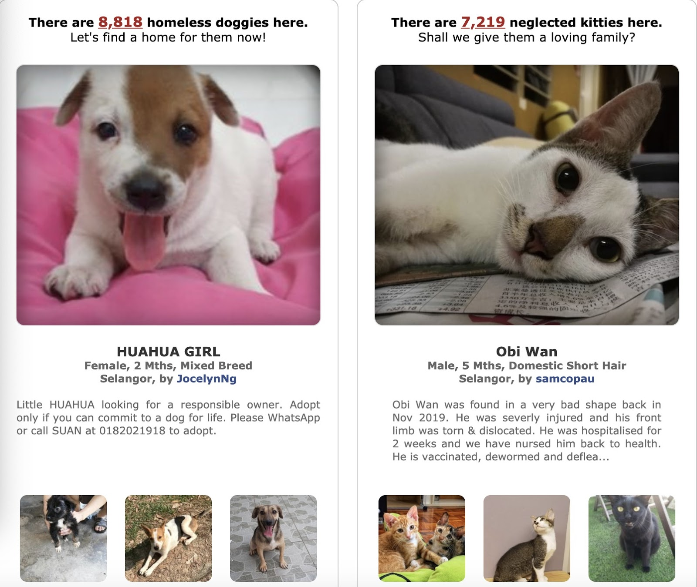

# ECE-143-Project-Group-2

This work addresses the problem of predicting the adoption speed of pets and analyze the data.
<br>
<p align="center">
    
</p>

## Dependencies
Our work is implemented in Python, please install the following packages first.

- Python 3
- numpy
- lightgbm
- sklearn
- pandas
- wordcloud
- seaborn
- plotly
- json
- matplotlib
- gc
- tqdm


```shell
# Download this code
git clone https://github.com/Klye-1002/ECE-143-Project-Group-2.git
cd ECE-143-Project-Group-2
```
## Overview
We provide:
- Downloaded data from Kaggle
- Code for data analysis
- Code for prediction model and result visualization
- Jupyter notebook which shows all the visualizations

### Data
The data is already downloaded from Kaggle and we delete some unused data.
You are highly recommended to use our downloaded data because the origin dataset is large.
You can also downloaded the data youself (Kaggel account needed) and put them in `./data/`
```shell
pip install kaggle
```
After kaggle api, you need to export your Kaggle username and token to the environment. The instruction can be found at [kaggle-api](https://github.com/Kaggle/kaggle-api)
```shell
kaggle competitions download -c petfinder-adoption-prediction
```
The data includes adoption speed, type, name, age, breed, etc.

### Jupyter Notebook
We provide the notebook version of of code in Data Visualization & Prediction Results.ipynb.
You can also run the following code attached.

### Data Analysis
```shell
python src/data_analysis.py
```

### Train LightGBM Model and Result Visuslization
```shell
python src/prediction_visualization.py
```

